

 

---

## About Me

I'm a **Senior Angular Developer** from Brazil with **8+ years** building web applications end-to-end. I specialize in the Angular ecosystem and backend development with NestJS, working across the full stack from reactive UIs to REST APIs backed by PostgreSQL, MongoDB, and Redis.

My background spans **financial systems** and **biotech research platforms** — building reactive architectures, developing complex RxJS pipelines, and migrating AngularJS applications to modern Angular.

- Frontend: **Angular · TypeScript · RxJS · Angular Material**
- Backend: **NestJS · Node.js · Express · TypeORM · Prisma**
- Data & Infra: **PostgreSQL · MongoDB · Redis · Docker · Docker Compose · AWS**
- Fluent in **English** and **Portuguese** · Open to remote and global opportunities

---

## Tech Stack

**Frontend**

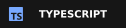
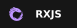
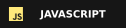
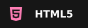
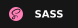

**Backend**

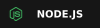
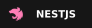

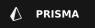
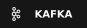

**Databases**

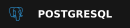
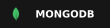

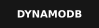

**Cloud & DevOps**

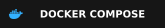
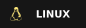
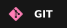

**Testing**

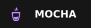

---

## Projects

<a href="https://github.com/gabriellaines/PDFSpacedRepetition">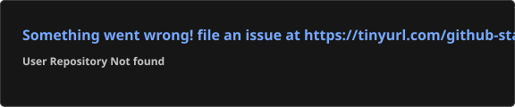</a>

<a href="https://github.com/gabriellaines/jornada-milhas"></a>

---

[](https://github.com/gabriellaines)
[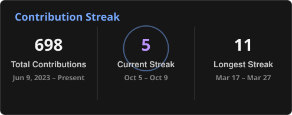](https://github.com/gabriellaines)

[](https://github.com/gabriellaines)

[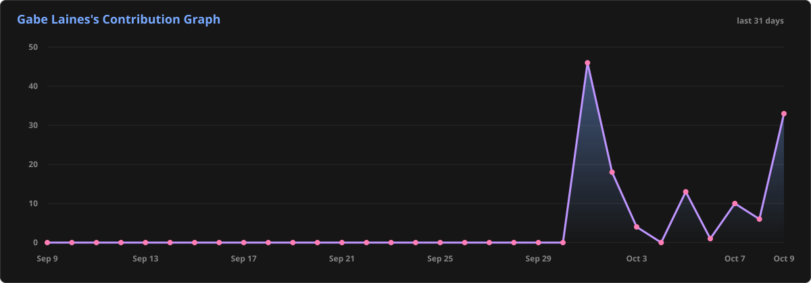](https://github.com/gabriellaines)

